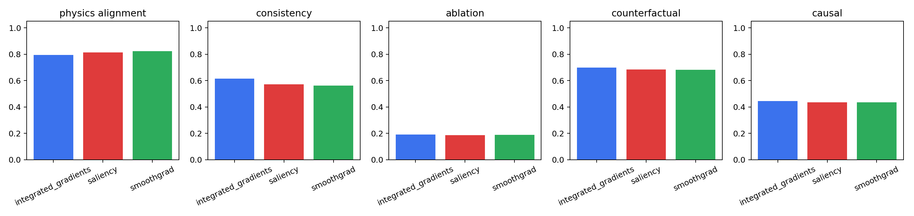
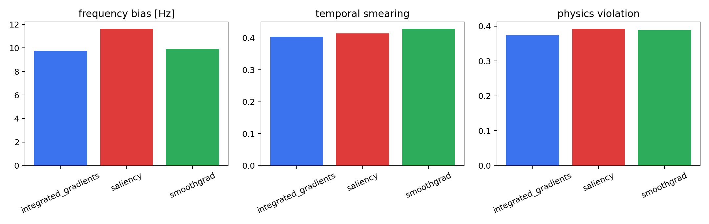
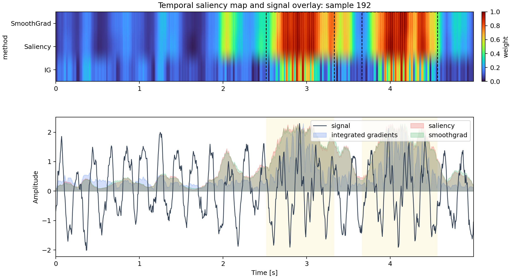

# Physics-Guided Explainable AI for Time-Series Signals

This project evaluates whether time-series explanations are physically meaningful, not just whether the classifier is accurate.

## What Changed

The benchmark was upgraded from a simple synthetic classification task to a harder research setting:

- non-stationary signals with frequency drift `f(t)`
- overlapping spectral components
- colored noise instead of only white noise
- multiple anomaly regions
- three XAI methods: Integrated Gradients, Saliency, SmoothGrad
- causal evaluation through attribution ablation and ground-truth counterfactual removal

## Problem

The model classifies three signal types:

- `normal`: drifting 5 Hz baseline with overlapping mixtures and colored noise
- `fault_light`: non-stationary 20 Hz anomaly with broad temporal support
- `fault_heavy`: localized 50 Hz burst across multiple anomaly regions

The scientific question is:

**Does the model rely on the true physical anomaly, or on predictive but non-physical correlations?**

## Method

### Inputs and model

- raw signal
- FFT magnitude
- dominant frequency
- classifier: reproducible PyTorch 1D CNN

### XAI methods

- Integrated Gradients
- Saliency
- SmoothGrad

### Physics-aware metrics

- `consistency_score`: attribution overlap with ground-truth anomaly regions
- `attribution_score`: alignment between attribution-weighted frequency and true fault frequency
- `ablation_score`: prediction drop after removing top-attribution points
- `counterfactual_consistency`: prediction and attribution response after removing the true anomaly
- `physics_violation_score`: combined penalty for frequency bias and temporal smearing
- `causal_score`: average of ablation and counterfactual consistency

## Main Results

Current run:

- seed: `42`
- samples per class: `180`
- held-out accuracy: `0.907`

Overall XAI comparison:

| method | attribution_score | consistency_score | ablation_score | counterfactual_consistency | causal_score | physics_violation_score |
| --- | --- | --- | --- | --- | --- | --- |
| integrated_gradients | 0.7940 | 0.6144 | 0.1916 | 0.6981 | 0.4448 | 0.2210 |
| saliency | 0.8134 | 0.5707 | 0.1869 | 0.6829 | 0.4349 | 0.2318 |
| smoothgrad | 0.8228 | 0.5631 | 0.1880 | 0.6812 | 0.4346 | 0.2317 |

Key findings:

- `integrated_gradients` is best overall by causal score.
- `smoothgrad` gives the best average frequency alignment, but not the best causal behavior.
- `fault_heavy` remains the hardest case for every method.
- The main failure mode is not random noise. It is **frequency bias plus temporal smearing**.

Fault-heavy summary:

| method | attribution_score | consistency_score | causal_score | physics_violation_score | frequency_bias_hz | temporal_smearing |
| --- | --- | --- | --- | --- | --- | --- |
| integrated_gradients | 0.6842 | 0.5967 | 0.6019 | 0.3741 | 9.7462 | 0.4033 |
| saliency | 0.6508 | 0.5864 | 0.5907 | 0.3921 | 11.6231 | 0.4136 |
| smoothgrad | 0.6901 | 0.5718 | 0.5893 | 0.3887 | 9.9231 | 0.4282 |

Conclusion:

**Correct prediction does not imply causally faithful explanation.**  
In the upgraded benchmark, the classifier still performs well, but all XAI methods show measurable failure on non-stationary burst faults, especially through drifted frequency emphasis and attribution spread outside the true anomaly windows.

## Visualizations

Method comparison:



Fault-heavy failure modes:



Example temporal saliency overlay:



## Run

```bash
python3 -m venv .venv
.venv/bin/pip install -r requirements.txt
.venv/bin/python -m src.generate
.venv/bin/python -m src.train
.venv/bin/python -m src.xai
.venv/bin/python -m src.analysis
```

## Repository

```text
xai-physics/
├── data/
├── outputs/
├── src/
│   ├── generate.py
│   ├── features.py
│   ├── model.py
│   ├── train.py
│   ├── xai.py
│   ├── metrics.py
│   └── analysis.py
├── README.md
└── requirements.txt
```

Core files:

- [src/generate.py](src/generate.py): hard non-stationary signal simulation and counterfactual generation
- [src/train.py](src/train.py): model training and prediction export
- [src/xai.py](src/xai.py): multi-method attribution and causal evaluation
- [src/metrics.py](src/metrics.py): physics-aware and causal metrics
- [src/analysis.py](src/analysis.py): quantitative comparison and failure-mode analysis
