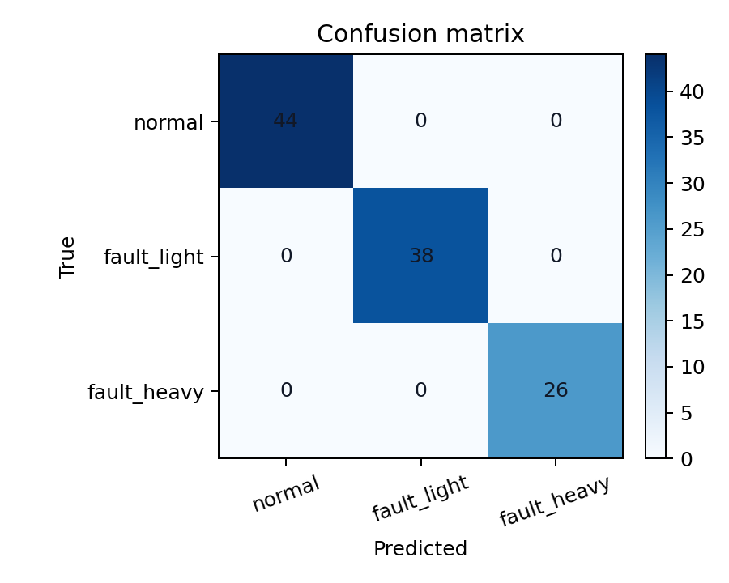
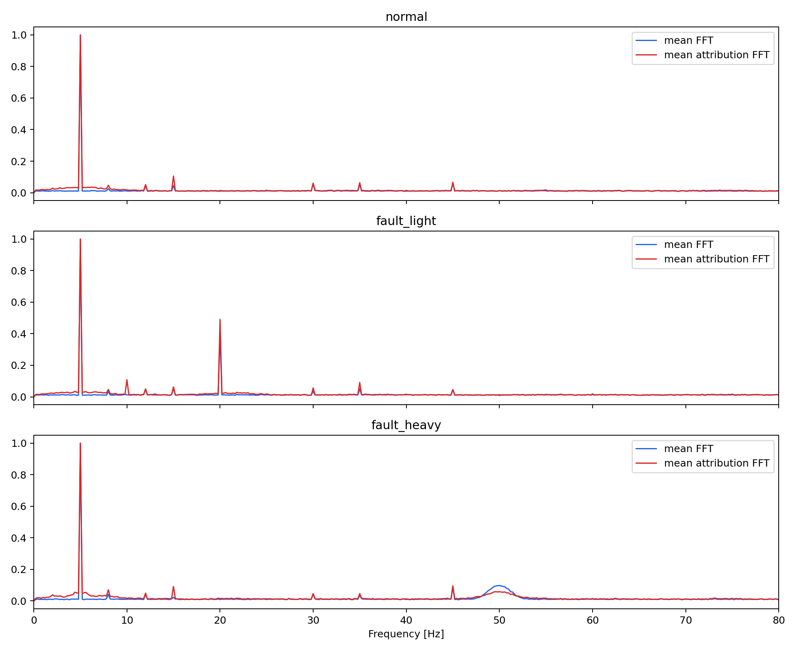

# Physics-Guided Explainable AI for Time-Series Signals

Research-grade project for evaluating whether explainable AI methods align with known physical properties of time-series signals, not just whether they improve classification accuracy.

**Core thesis:** I evaluate whether explainable AI methods align with physical signal properties using novel metrics for consistency, frequency alignment, stability, and temporal coherence.

## Why This Project Matters

High classification accuracy does not guarantee that a model is reasoning about the right physics. In many signal-processing applications, an explanation is only useful if it focuses on the correct time region, preserves the correct spectral content, and remains stable under small perturbations.

This repository builds a complete experimental pipeline to test that claim end to end:

- Physics-based signal simulation with controllable faults and noise.
- A reproducible PyTorch 1D CNN for multi-class classification.
- Integrated Gradients with temporal smoothing for attribution.
- Novel physics-aware metrics that compare explanations against known ground-truth signal structure.

## Research Question

Does a neural network learn physically meaningful fault structure, or does it exploit correlations that are sufficient for classification but not faithful to the underlying signal mechanism?

## Highlights

- Synthetic dataset with three classes: `normal`, `fault_light`, `fault_heavy`.
- Multi-frequency mixtures and variable Gaussian noise.
- Dual-view input representation: raw waveform plus FFT magnitude.
- Captum Integrated Gradients explanations.
- Physics-aware evaluation beyond accuracy.
- Fully reproducible outputs saved to disk.

## Signal Model

Each signal has length `T = 1000` and sample rate `f_s = 200 Hz`.

Baseline process:

```text
x_base(t) = A_5 sin(2π·5t + φ_5) + Σ_{k=1..K} A_k sin(2π f_k t + φ_k) + ε(t)
```

where:

- `f_k` are nuisance mixture frequencies.
- `K ∈ {1, 2}`.
- `ε(t) ~ N(0, σ²)` with variable `σ`.

Class-specific signals:

```text
x_normal(t) = x_base(t)
```

```text
x_fault_light(t) = x_base(t) + A_20 sin(2π·20t + φ_20)
```

```text
x_fault_heavy(t) = x_base(t) + w(t; τ_0, τ_1) A_50 sin(2π·50t + φ_50)
```

where `w(t; τ_0, τ_1)` is a Hann-windowed burst active only inside the annotated anomaly interval.

## Method Overview

### Data Generation

The simulator creates:

- `normal`: 5 Hz baseline sinusoid with Gaussian noise.
- `fault_light`: baseline plus a global 20 Hz component.
- `fault_heavy`: baseline plus a localized 50 Hz burst.

Each sample also includes:

- Multi-frequency mixtures.
- Variable noise levels.
- Ground-truth metadata including dominant fault frequency and anomaly region.

Saved artifacts:

- `data/signals.npy`
- `data/labels.npy`
- `data/metadata.csv`

### Model

The classifier is a reproducible PyTorch 1D CNN using:

- Channel 1: normalized raw signal.
- Channel 2: resized log-FFT magnitude.
- Auxiliary scalar: dominant FFT frequency.

Training setup:

- Deterministic seed.
- 80/20 train-test split.
- Cross-entropy loss.
- Adam optimizer.

### Explainability

Attributions are computed with Captum Integrated Gradients on the predicted class. The raw-signal attribution channel is then smoothed in time to suppress spurious high-frequency saliency fluctuations and support physical interpretation.

Saved artifacts:

- `outputs/attributions.npy`
- `outputs/smoothed_attributions.npy`
- `outputs/plots/overlay_sample_*.png`

## Physics-Aware Evaluation Metrics

### 1. Physical Consistency Score

Measures how much positive attribution mass overlaps the true anomaly interval:

```text
PCS = Σ_{t ∈ Ω_anomaly} ã(t)
```

where `ã(t)` is normalized positive attribution.

### 2. Frequency Alignment Score

Measures agreement between the dominant FFT frequency `f_FFT` and the dominant frequency of the attribution-weighted signal `f_attr`:

```text
FAS = exp(-|f_FFT - f_attr| / 10)
```

### 3. Stability

Adds noise to the input signal and measures how much the attribution map changes.

### 4. Temporal Coherence

Measures whether attribution evolves smoothly across time instead of oscillating erratically.

## Repository Structure

```text
xai-physics/
├── data/
├── outputs/
├── src/
│   ├── analysis.py
│   ├── features.py
│   ├── generate.py
│   ├── metrics.py
│   ├── model.py
│   ├── train.py
│   └── xai.py
├── README.md
└── requirements.txt
```

## Reproducible Run

```bash
python3 -m venv .venv
.venv/bin/pip install -r requirements.txt
.venv/bin/python -m src.generate
.venv/bin/python -m src.train
.venv/bin/python -m src.xai
.venv/bin/python -m src.analysis
```

## Generated Outputs

Running the full pipeline produces:

- `data/signals.npy`, `data/labels.npy`, `data/metadata.csv`
- `outputs/model.pt`, `outputs/train_history.csv`, `outputs/test_predictions.csv`
- `outputs/attributions.npy`, `outputs/smoothed_attributions.npy`, `outputs/xai_metrics.csv`
- `outputs/confusion_matrix.csv`, `outputs/class_frequency_table.csv`, `outputs/insights.txt`
- `outputs/plots/*.png` for confusion matrices, attribution overlays, and FFT alignment figures

## Results From the Current Run

Configuration:

- Seed: `42`
- Samples per class: `180`
- Signal length: `1000`
- Sample rate: `200 Hz`

Aggregate metrics:

- Held-out classification accuracy: `1.000`
- Diagnostic frequency alignment: `0.960`
- True-physics attribution score: `0.836`
- Attribution stability under noise: `0.973`
- Temporal coherence: `0.933`

Per-class summary:

| class | true_freq | predicted_freq | attribution_score | consistency_score |
| --- | --- | --- | --- | --- |
| fault_heavy | 50.00 | 30.71 | 0.3198 | 0.0831 |
| fault_light | 20.00 | 20.00 | 1.0000 | 1.0000 |
| normal | 5.00 | 5.00 | 1.0000 | n/a |

## Key Findings

- The CNN classifies all three classes correctly on the held-out split.
- For `fault_light`, attribution-weighted spectra recover the injected `20 Hz` component exactly.
- For `fault_heavy`, the explanation is not physically faithful even though the classifier is correct.
- The heavy-fault explanation localizes weakly to the true burst interval (`PCS = 0.0831`).
- The attribution-weighted frequency for `fault_heavy` drifts toward `30.71 Hz` rather than the injected `50 Hz`.

This is the main scientific result of the repository: **predictive success does not imply physically faithful explanation**.

## Representative Visualizations

Confusion matrix:



Average attribution overlay by class:


Average FFT vs attribution-weighted FFT by class:



## Interpretation

The results show a mixed answer to the main research question:

- The network learns the spectral physics of `fault_light`.
- The explanations are stable and temporally smooth overall.
- The network does not fully learn the transient burst physics of `fault_heavy`, despite perfect accuracy.

That gap is exactly what the proposed evaluation protocol is designed to expose. The classifier can solve the task while still relying on correlated side-effects or partial spectral cues instead of the true localized anomaly.

## Files of Interest

- [src/generate.py](src/generate.py): physics-based signal simulation.
- [src/features.py](src/features.py): raw/FFT feature construction.
- [src/model.py](src/model.py): 1D CNN definition and deterministic setup.
- [src/train.py](src/train.py): training loop and prediction export.
- [src/xai.py](src/xai.py): Integrated Gradients and attribution generation.
- [src/metrics.py](src/metrics.py): physics-aware evaluation metrics.
- [src/analysis.py](src/analysis.py): summary tables, figures, and insight generation.

## Discussion

This project is intended as a compact research testbed for the question:

**Does AI learn physics, or does it learn correlations that merely look predictive?**

The answer depends on more than accuracy. A trustworthy explanation for physical signals should:

- Concentrate on the correct time interval.
- Preserve the relevant spectral content.
- Remain stable under small perturbations.
- Produce interpretable temporal structure.

This repository operationalizes those criteria into measurable metrics and demonstrates a case where explanation quality and classification quality diverge.
