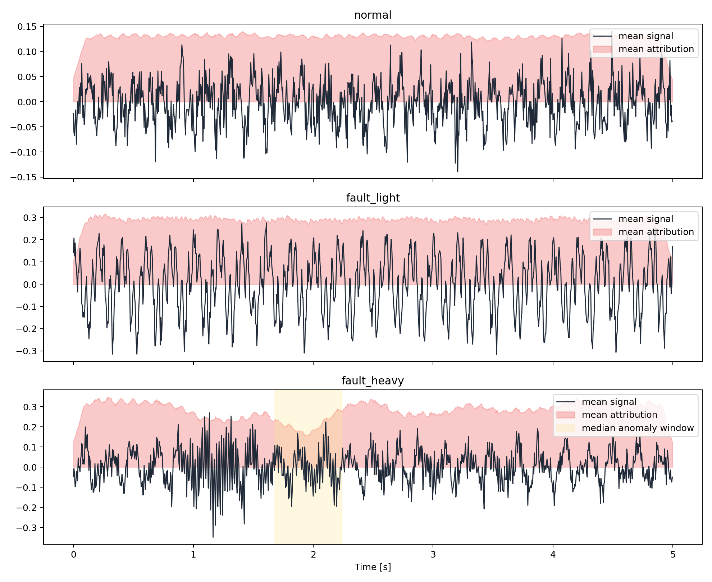

# Physics-Guided Explainable AI for Time-Series Signals

This project tests whether explainable AI methods align with known physical properties of time-series signals, not just whether they support accurate classification.

## Problem

The task is a 3-class signal classification problem with physics-based synthetic data:

- `normal`: 5 Hz sinusoid with Gaussian noise
- `fault_light`: baseline plus a global 20 Hz component
- `fault_heavy`: baseline plus a localized 50 Hz burst

The main question is:

**Does the model focus on the true physical structure of the signal, or does it rely on correlations that are sufficient for prediction but not physically faithful?**

## Approach

### Signal model

Each signal has length `T = 1000` and sample rate `f_s = 200 Hz`.

```text
x_base(t) = A_5 sin(2π·5t + φ_5) + Σ_{k=1..K} A_k sin(2π f_k t + φ_k) + ε(t)
```

```text
x_normal(t) = x_base(t)
x_fault_light(t) = x_base(t) + A_20 sin(2π·20t + φ_20)
x_fault_heavy(t) = x_base(t) + w(t; τ_0, τ_1) A_50 sin(2π·50t + φ_50)
```

where `w(t; τ_0, τ_1)` is a Hann-windowed burst active only inside the annotated anomaly interval.

### Model and XAI

- Features: raw signal, FFT magnitude, dominant frequency
- Model: reproducible PyTorch 1D CNN
- Explainer: Captum Integrated Gradients
- Post-processing: temporal smoothing of attribution

## Evaluation

The project evaluates explanations with physics-aware metrics:

- **Physical Consistency Score**

  ```text
  PCS = Σ_{t ∈ Ω_anomaly} ã(t)
  ```

  Measures how much attribution overlaps the true anomaly interval.

- **Frequency Alignment Score**

  ```text
  FAS = exp(-|f_FFT - f_attr| / 10)
  ```

  Measures agreement between signal frequency content and attribution-weighted frequency content.

- **Stability**

  Measures attribution change after adding noise.

- **Temporal Coherence**

  Measures whether attribution varies smoothly over time.

## Main Result

Current run configuration:

- seed: `42`
- samples per class: `180`

Aggregate results:

- accuracy: `1.000`
- diagnostic frequency alignment: `0.960`
- true-physics attribution score: `0.836`
- stability: `0.973`
- temporal coherence: `0.933`

Per-class summary:

| class | true_freq | predicted_freq | attribution_score | consistency_score |
| --- | --- | --- | --- | --- |
| fault_heavy | 50.00 | 30.71 | 0.3198 | 0.0831 |
| fault_light | 20.00 | 20.00 | 1.0000 | 1.0000 |
| normal | 5.00 | 5.00 | 1.0000 | n/a |

Key takeaway:

- The classifier is perfect on the held-out set.
- The explanation is physically faithful for `fault_light`.
- The explanation is **not** physically faithful for `fault_heavy`, despite correct prediction.

This is the central finding of the repository: **high predictive accuracy does not guarantee physically meaningful explanations**.

## Visualization



## Run

```bash
python3 -m venv .venv
.venv/bin/pip install -r requirements.txt
.venv/bin/python -m src.generate
.venv/bin/python -m src.train
.venv/bin/python -m src.xai
.venv/bin/python -m src.analysis
```

## Repository

```text
xai-physics/
├── data/
├── outputs/
├── src/
│   ├── generate.py
│   ├── features.py
│   ├── model.py
│   ├── train.py
│   ├── xai.py
│   ├── metrics.py
│   └── analysis.py
├── README.md
└── requirements.txt
```

Core files:

- [src/generate.py](src/generate.py): signal simulation
- [src/train.py](src/train.py): model training
- [src/xai.py](src/xai.py): attribution generation
- [src/metrics.py](src/metrics.py): physics-aware metrics
- [src/analysis.py](src/analysis.py): plots, tables, and auto-generated findings
